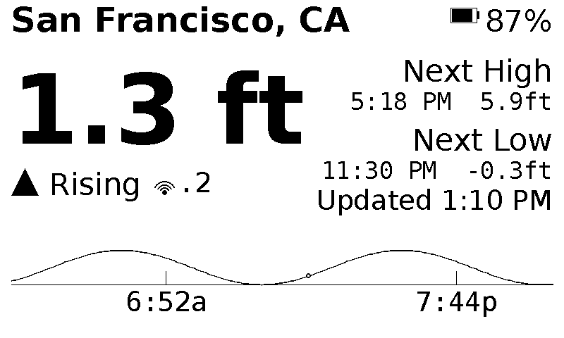

# Tide Watch

A tide monitor for a Raspberry Pi and a small e-ink display. Pulls
live predictions from NOAA's CO-OPS API for whatever tide station you
point it at and shows current height, rising/falling state, next
high/low, and a 24-hour curve — updating every 20 minutes, using zero
power to hold the image between refreshes.


*(rendered example output — actual e-ink contrast is higher than this preview)*

**No Raspberry Pi experience needed.** This guide assumes you've never
set one up before and walks through every step, from buying the parts
to seeing live tide data on the screen. If you've done this kind of
thing before, feel free to skip ahead to [Quick
start](#quick-start-for-the-experienced).

## What you'll need

- **A Raspberry Pi Zero W or Zero 2 W** — a small, cheap ($15–20)
  computer about the size of a stick of gum. Either works fine for
  this project.
- **A Waveshare e-ink display "HAT"** — a small screen that plugs
  directly onto the Pi's pins, no soldering required. "HAT" just means
  it's designed to sit on top of the Pi like a hat. This project
  supports five sizes: 2.13", 2.7", 2.9", 4.2", and 7.5". If you're not
  sure which to get, **the 2.13" is the cheapest and simplest place to
  start.** Make sure you get the plain black-and-white version, not a
  color one — this project is built for black-and-white e-ink panels.
  This matters especially for the 2.7": Waveshare also sells a
  red/black/white "2.7inch e-Paper HAT **(B)**" — that's a different,
  unsupported product. The plain "2.7inch e-Paper HAT" (no letter after
  it, the one with the 4 onboard buttons) is the one this project
  supports.
- **A microSD card**, 8 GB or larger, plus a way to plug it into your
  own computer (many laptops have a slot built in; otherwise a cheap
  USB adapter works).
- **A power supply** for the Pi — a standard 5V phone charger with a
  micro-USB cable works, though a proper Raspberry Pi power supply is
  safer if you're going to leave this running long-term.
- **A Wi-Fi network** the Pi can join, and its password.
- **Your own computer** (Windows, Mac, or Linux) to do the setup from.
- *Optional:* a PiSugar battery HAT if you want this to run without
  being plugged in, and a case to protect everything.

Total cost for the cheapest version (Pi Zero W + 2.13" display + SD
card) is typically $30–40.

## Overview

There are two computers involved here: **yours**, which you use to
prepare the SD card and generate a setup script, and **the Pi**, which
actually runs the display. You'll go back and forth between them a
few times. The whole process:

1. Write Raspberry Pi OS onto the SD card, using your computer.
2. Boot the Pi and connect to it remotely from your computer (this is
   called SSH — more on that below).
3. Use the setup tool (a single file called `index.html`, opened right
   in your regular browser) to generate a script customized for your
   Wi-Fi, your tide station, and your display.
4. Paste that script into the Pi and let it run.
5. Reboot the Pi. The display starts showing live tide data.

None of this requires plugging a keyboard, mouse, or monitor into the
Pi itself — everything is done remotely from your own computer.

## Step 1: Write Raspberry Pi OS to the SD card

1. On your own computer, download **Raspberry Pi Imager** from
   [raspberrypi.com/software](https://www.raspberrypi.com/software/)
   and install it.
2. Insert the microSD card into your computer.
3. Open Raspberry Pi Imager.
4. Click **Choose Device** and select your Pi model (Zero W or Zero 2 W).
5. Click **Choose OS** → **Raspberry Pi OS (other)** → **Raspberry Pi
   OS Lite (32-bit)**. "Lite" means it has no desktop or graphical
   interface — you don't need one, since everything is controlled
   remotely and the e-ink panel is the only "screen" this project
   uses.
6. Click **Choose Storage** and select your SD card. Double-check
   you've picked the right one — this step erases everything on it.
7. **Before clicking Next, click the gear/settings icon** (may say
   "Edit Settings" depending on version). This is the most important
   part of this whole step:
   - Set a **hostname** — `tidewatch` is a good choice, and this guide
     assumes you used it. This is how you'll reach the Pi later
     (`tidewatch.local`).
   - Under "Enable SSH," choose **"Use password authentication"** and
     set a **username and password**. Write these down — you'll need
     them in a minute.
   - Set your **Wi-Fi SSID and password** so the Pi connects to your
     network automatically on first boot.
   - Save these settings.
8. Click **Write**, confirm, and wait for it to finish (a few
   minutes). It's normal for it to verify the write afterward too.

## Step 2: Attach the e-ink display

With the Pi **powered off** and the SD card **not yet inserted** (or
just powered off if it is), line up the display's connector with the
row of pins along the edge of the Pi and press down firmly and evenly
until it's fully seated, flush against the board. It only fits one
way. If anything feels like it's forcing or misaligned, stop and check
against the photos on the display's product page before pressing
further.

## Step 3: Boot the Pi and connect to it

1. Insert the microSD card into the Pi.
2. Connect the power supply. Give it about a minute or two to boot for
   the first time.
3. On your own computer, open a terminal:
   - **Mac**: open the "Terminal" app (search for it with Spotlight,
     Cmd+Space).
   - **Windows**: open "PowerShell" or "Windows Terminal" (search for
     it in the Start menu).
   - **Linux**: you know where this is.
4. Type this, using the username you set in Step 1, and press Enter:
   ```
   ssh username@tidewatch.local
   ```
   The first time, it'll ask something like "Are you sure you want to
   continue connecting?" — type `yes` and press Enter. Then enter the
   password you set in Step 1 (the cursor won't move as you type —
   that's normal, it's just not showing the password).
5. If it works, you'll see a command prompt that mentions your
   username and `tidewatch` — you're now controlling the Pi remotely.

**If `tidewatch.local` doesn't work:** this usually means your network
doesn't support that kind of address resolution (more common on some
Windows setups). Check your Wi-Fi router's admin page for a list of
connected devices to find the Pi's IP address instead (it'll be named
`tidewatch`), and use `ssh username@that-ip-address` instead.

## Step 4: Generate your setup script

1. Open the setup tool: **[inphenity.github.io/TideWatch](https://inphenity.github.io/TideWatch/)**
   — this runs entirely in your browser; nothing you type is sent
   anywhere. (If you'd rather not rely on that link staying up, you can
   also download [`index.html`](index.html) from this repository onto
   your own computer and double-click it to open the exact same tool
   offline.)
2. Fill in:
   - Your Wi-Fi network name(s) and password(s) — this is copied onto
     the Pi so it can reconnect on its own after reboots.
   - Your **NOAA tide station** — find yours at
     [tidesandcurrents.noaa.gov/map](https://tidesandcurrents.noaa.gov/map/).
   - Your **display size**, matching the panel you bought.
   - Any optional features you want (battery support, sunrise/sunset
     display, etc.) — defaults are reasonable if you're not sure.
3. Click **Generate install script**.
4. Click **Copy to clipboard** (or download it as a file instead).

## Step 5: Run the script on the Pi

Back in your SSH terminal window from Step 3:

1. Paste the script you just copied (right-click → Paste, or
   Cmd+V / Ctrl+V) and press Enter.
2. It will take several minutes — a Pi Zero is a small, slow computer,
   and this installs a fair amount of software. Let it run; it prints
   progress messages as it goes.
3. When it finishes, it prints a summary of what was installed and
   configured.

## Step 6: Reboot and check the display

Run:
```
sudo reboot
```
Your SSH session will disconnect (that's expected). Wait about a
minute, then look at the physical e-ink display — it should be showing
live tide data. If it's blank or looks wrong, see
[Troubleshooting](#troubleshooting) below.

From here on, the Pi keeps running on its own — refreshing the display
every 20 minutes, reconnecting to Wi-Fi automatically, and requiring
no further attention. See [Web config page](#web-config-page) below
for how to change settings later without repeating any of this.

## Troubleshooting

- **`ssh: Could not resolve hostname tidewatch.local`** — see the note
  at the end of Step 3 about finding the Pi's IP address directly.
- **"Permission denied" when trying to SSH in** — double check the
  username and password you set in Raspberry Pi Imager's settings
  screen; these are easy to mistype or forget you changed.
- **The display stays blank after rebooting** — make sure the e-ink
  HAT is fully and firmly seated on the Pi's pins (see Step 2), and
  that the display size you chose in the setup tool actually matches
  the panel you have.
- **The install script prints errors about `apt update` failing** —
  this almost always means the Pi isn't actually connected to Wi-Fi.
  Double check the network name and password you entered in Raspberry
  Pi Imager's settings screen were correct.
- **Something else went wrong partway through the script** — it's
  generally safe to just paste the whole script in again; each step is
  written to not fail just because it was already done once.

## Quick start (for the experienced)

Open the setup tool — **[inphenity.github.io/TideWatch](https://inphenity.github.io/TideWatch/)**,
or [`index.html`](index.html) from this repo if you'd rather run it
offline — fill in your Wi-Fi networks and tide station, click
generate, and paste the resulting script into a fresh Raspberry Pi OS
Lite install over SSH. It sets up everything: the Python environment,
the e-ink driver, the web config page, the Wi-Fi fallback hotspot, all
of it — there's no separate manual setup path to follow.

## Features

- **Live NOAA data** — current height, rising/falling, next high/low,
  and a smooth tide curve (cosine-interpolated between real high/low
  points for stations that don't publish continuous predictions)
- **Any NOAA tide station** — not hardcoded to one location; validated
  against NOAA's live API before saving, so a bad station ID is caught
  immediately instead of showing up later as a blank display
- **Five Waveshare panel sizes** out of the box (2.13", 2.7", 2.9",
  4.2", 7.5") with a layout that actually adapts to each one, not just scales
- **Optional PiSugar battery support** (S, S Plus, 2, 2 Pro, 3, 3
  Plus) — battery icon and percentage right on the display
- **Web config page** — change settings from a browser instead of SSH.
  Logging in requires physical access to the device itself: there's no
  password stored anywhere, just a fresh single-use PIN shown on the
  actual e-ink panel when you ask for one
- **Wi-Fi fallback hotspot** — if the Pi ever can't reach a known
  network, it broadcasts its own (with a freshly random password shown
  on the display, never a fixed one) so it's never completely
  unreachable, and switches back automatically once a real network's
  available again
- **Sunrise/sunset** — as small marks on the tide curve, as its own
  dedicated sun-position graphic in place of the curve, or (on larger
  panels) both stacked together
- **Screen flip** for panels mounted upside down
- **One file, `index.html`**, generates a complete, customized install
  script for all of the above — everything (the Python code, the
  systemd services, the driver setup) is embedded in it and written out
  by the script it generates, so there's nothing else to download or
  keep in sync by hand

## How it's split up

The generated install script writes out several files on the Pi, each
with one clear job:

- `tide_eink.py` — the display itself: fetches from NOAA, renders the
  image, draws it to the panel, and loops on a refresh timer. Structured
  internally so that fetching (`fetch_tide_data()`), rendering
  (`render_image()`), and the hardware-specific part
  (`display_image()`) are fully separate — picking a different panel
  only ever means changing `display_image()` and two size constants,
  nothing else.
- `config_server.py` — the web config page, running as a separate,
  entirely optional process. It deliberately **never** imports the
  e-ink driver or touches GPIO/SPI — the only way it affects the
  display is by writing `config.json` and dropping small request files
  that `tide_eink.py` itself polls for and acts on. Keeping them fully
  separate like this means the two processes can never end up fighting
  over the same hardware pins, which is a real failure mode when two
  things both try to hold a GPIO-based display driver open at once.
- `hotspot_monitor.sh` — run periodically by a systemd timer, brings up
  a fallback Wi-Fi hotspot (with a freshly random password) if no known
  network is reachable, and switches back automatically once one is.
  Like `config_server.py`, it never touches the display directly —
  it hands the current hotspot info to `tide_eink.py` the same
  file-based way.

## Web config page

Instead of SSH-ing in every time you want to change the station,
refresh interval, flip orientation, or toggle PiSugar, there's a small
page for exactly that, installed automatically. Logging in requires
physical access to the device itself — there's no fixed password
stored anywhere. Clicking "Show PIN on display" generates a fresh,
random, six-digit PIN, drops a request file, and `tide_eink.py`'s own
already-running process (never `config_server.py` — see above) draws it
on the physical panel. The PIN is single-use (burned the instant it's
entered correctly) and expires on its own after 5 minutes regardless.

Visit `http://<hostname>.local:8080` (or the Pi's IP address if
`.local` doesn't resolve — check with `hostname -I`), click "Show PIN
on display," read the PIN off the physical panel, and enter it. Saving
a settings change writes `config.json` and drops a trigger file;
`tide_eink.py`'s own process notices it within a few seconds and
restarts itself to pick up the new settings.

The page also includes a "Wi-Fi networks" section for adding a new
network without SSH — useful if you're connected via the fallback
hotspot below and need to get the Pi onto a real network. It saves the
network but doesn't connect to it immediately: that would mean the
same request's response has to survive the exact moment the hotspot
drops out from under the browser reading it, since it's the same radio
switching roles. Instead the save just makes the network known, and
`hotspot_monitor.sh`'s own periodic check picks it up the same way it
tries any other known network. If the page stops responding shortly
after saving, that's usually the connection working, not a problem.

## Wi-Fi fallback hotspot

If none of the Wi-Fi networks you configured are reachable — the device
gets moved somewhere new, a router gets replaced — the Pi would
otherwise just go dark with no way to reach it. A systemd timer checks
every couple of minutes and:

- If a real network is already connected, does nothing.
- If it's currently broadcasting its own fallback network and a known
  network becomes reachable again, switches back automatically — no one
  needs to intervene once the Pi is back in range of somewhere it
  recognizes.
- Otherwise, brings up a dedicated hotspot so the device is still
  reachable at a fixed address, `10.42.0.1` — that's NetworkManager's
  own default gateway address for shared-mode connections, not
  something specific to this project.

The hotspot's password isn't fixed. Each time it actually comes up, a
fresh one is randomly generated and shown directly on the physical
e-ink display — the same reasoning as the web config page's login PIN,
applied to the network itself: it should only ever be learnable by
looking at the device, not sitting in a config file anyone could read.
The password stays the same for as long as the hotspot remains
continuously active, and a new one is only generated the next time it
has to come up from a fully disconnected state.

Once connected to that network from a phone or laptop, the web config
page is reachable at `http://10.42.0.1:8080`, and the PIN screen itself
will show that same address instead of a real local IP whenever the
hotspot is the thing that's actually active. If someone requests the
login PIN while the hotspot info screen is already showing, the login
PIN takes over the display (it's the more time-sensitive thing at that
moment), and the display reverts back to the hotspot info — not the
normal tide screen — once that request expires or is used, since the
hotspot being up is still the relevant thing to show at that point.

## Battery (optional PiSugar support)

If you've got a PiSugar HAT (S, S Plus, 2, 2 Pro, 3, or 3 Plus — they all
work through the same setup), enable it in the setup tool and the
install script sets up `pisugar-server` for you. Once running,
`tide_eink.py` reads battery percentage and charging state from it every
refresh cycle and draws a small battery icon + percentage next to the
last-updated time. If `pisugar-server` isn't reachable (not installed,
or still starting up), the battery indicator is simply skipped for that
refresh — it never blocks the tide display itself.

To toggle this after install, use the web config page — no manual
`config.json` editing needed.

## Display modes: tide curve, sunrise/sunset graphic, or both

By default the bottom of the display shows today's tide curve, with an
optional small tick mark — labeled with the actual time, e.g. "6:52a" —
at sunrise and sunset (also toggleable from the web config page). This
works on every panel size, including the smallest ones: the curve
itself reserves a bit more room at the bottom specifically to keep
those labels legible rather than skipping them or shrinking them past
the point of being readable. Switching to the sunrise/sunset graphic
instead replaces that whole region with a dedicated sunrise-to-sunset
arc and a marker showing the sun's current position along it — useful
if you care more about daylight hours than the tide's shape on any
given day.

On panels with enough room (2.7", 4.2", and 7.5"), there's a third
option that shows both at once: a compact sun arc stacked above the
full tide curve, rather than having to choose between them. This
automatically falls back to the tide-curve-only layout on the 2.13"
and 2.9" panels regardless of the setting, since there isn't enough
absolute room on those to keep both halves legible — the 2.7" panel is
physically smaller than 4.2"/7.5" but has a squarer aspect ratio with
more usable height, confirmed by actually rendering it rather than
assumed from its size alone.

If sunrise/sunset can't be fetched for some reason, any of these modes
falls back to the plain tide curve automatically rather than leaving
part of the display blank.

## Configuration reference

All runtime settings live in `config.json` on the device, written by
the install script and editable afterward from the web config page.
The schema:

```json
{
  "station_id": "9414290",
  "station_label": "San Francisco, CA",
  "display_driver": "epd2in13_V4",
  "display_width": 250,
  "display_height": 122,
  "refresh_minutes": 20,
  "pisugar_enabled": false,
  "flip180": false,
  "show_sun_times": true,
  "display_mode": "tide_curve"
}
```

Station, refresh interval, flip, sun display, and PiSugar are all
editable from the web config page after install; display panel model
requires re-running the install script instead.

## Notes on e-ink specifically

- **Refresh rate**: tide predictions change slowly, so the display
  redraws every 20 minutes by default. Refreshing more often just adds
  wear with no real benefit.
- **Ghosting**: most panels want an occasional full clear to avoid
  ghost images building up — the generated code does one on every
  redraw, which is safest for a slow-changing display like this.
- **Partial refresh**: some Waveshare panels support a faster partial-
  refresh mode. Not used here for simplicity, but worth exploring later
  if you want snappier updates.

## Acknowledgments

- Tide predictions and station metadata from [NOAA's CO-OPS
  API](https://api.tidesandcurrents.noaa.gov/) — a free public service
- E-ink drivers from [Waveshare](https://github.com/waveshareteam/e-Paper)
- Battery support via [PiSugar](https://github.com/PiSugar/pisugar-power-manager-rs)

## License

MIT — see [LICENSE](LICENSE).
